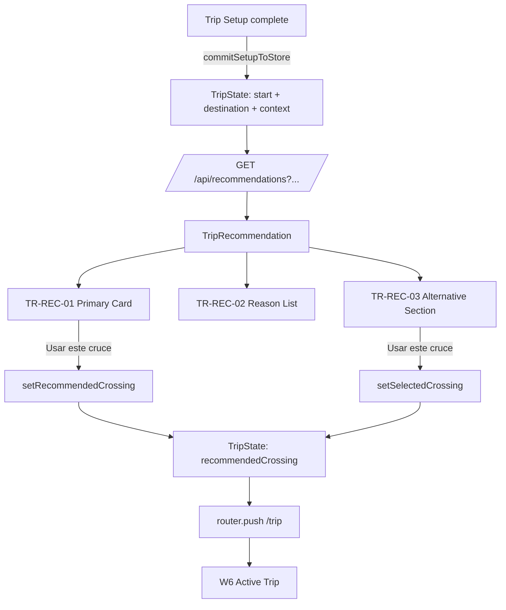

# T07 — Recommendation Workflow Specification
**Version:** 1.0 — 2026-09-08 — T07 locked; canonical types; commitment boundary; eligibility filtering. If version differs, revisit testing per `design/TESTING_INTEGRATION_PLAN.md:11` + `docs/TESTING_TOOLS.md`.

## Overview
| Field | Value |
|-------|-------|
| **Workflow ID** | T07 |
| **Name** | Trip Recommendation — contextual crossing selection |
| **Input** | TripSetupState (destination, origin, travelMode, direction, accessType, documentProfile, crossingCandidate) |
| **Output** | SelectedCrossing (persisted to TripState) |
| **Canonical types** | `TripRecommendation`, `SelectedCrossing`, `RecommendationReason` (`lib/recommendation/types.ts`) |
| **Predecessor** | Trip Setup (W2-W5) via `commitSetupToStore()` |
| **Successor** | W6 Active Trip |

## Flow Diagram


## Architecture

### Three distinct concepts
```text
TripRecommendation   → engine output (ephemeral, displayed by T07)
SelectedCrossing     → user choice (persisted to TripState)
RecommendationReason → structured reason (code + data, not prose)
```

### Crossing candidate vs recommended crossing
```text
crossingCandidate (TripSetupState)
  = input context from C03/C04 handoff
  = "the user came from this crossing"
  = does NOT override the engine

recommendedCrossing (TripState)
  = engine output selected by user
  = "the user chose this crossing for this trip"
  = committed at T07
```

### Commitment boundary
```text
"Usar este cruce"
  ↓
setRecommendedCrossing(rec: TripRecommendation)
  ↓
extracts SelectedCrossing from rec.primary
  ↓
stores SelectedCrossing (persisted) + TripRecommendation (ephemeral)
  ↓
router.push(/trip)
```

## API Contract

### Request
```
GET /api/recommendations
  ?origin=Tijuana
  &destination=San+Diego
  &originLat=32.5149
  &originLng=-117.0372
  &destLat=32.7157
  &destLng=-117.1611
  &direction=MX_TO_US
  &travelMode=privateVehicle
  &accessType=readyLane
  &documentProfile=passport
```

### Response
```typescript
{
  primary: {
    crossingName: string;
    mexicanCity: string;
    usCity: string;
    coordinates: { lat: number; lng: number };
    waitTime: number;
    totalJourneyTime: number;  // waitTime + approach estimate
    rank: "recommended";
    status: "open" | "limited" | "closed";
    generatedAt: string;
    isLive: boolean;
    crossingId: string;
    reasonCode: RecommendationReasonCode;
    reasonData: Record<string, string | number>;
  },
  alternatives: Array<{
    crossingId: string;
    crossingName: string;
    mexicanCity: string;
    usCity: string;
    coordinates: { lat: number; lng: number };
    waitTime: number;
    totalJourneyTime: number;
    deltaMinutes: number;
    status: "open" | "limited" | "closed";
    isLive: boolean;
    generatedAt: string;
  }>,
  context: {
    originName: string;
    destinationName: string;
    originLat: number;
    originLng: number;
    destLat: number;
    destLng: number;
    direction: string;
    travelMode?: string;
    accessType?: string;
    documentProfile?: string;
  },
  generatedAt: string;
}
```

## Eligibility Filtering

The API filters crossings by:
1. **Travel mode**: walking → pedestrian lanes only; commercial → commercial lanes; private → passenger lanes
2. **Status**: CLOSED excluded (fallback to closed if all are closed)
3. **Access type**: bonus scoring for SENTRI/Ready Lane lane match
4. **Live data**: confidence bonus for live vs estimated data

## Recommendation Reasons

Reasons use structured codes (not Spanish prose):

| Code | Meaning | Data |
|------|---------|------|
| `fastest_total_time` | Lowest total journey time | `{ deltaMinutes }` |
| `shortest_wait` | Lowest border wait time | `{ deltaMinutes }` |
| `best_access_match` | Best lane/access compatibility | `{ accessType }` |
| `only_open_option` | Only open crossing available | — |
| `closest_to_route` | Nearest to route midpoint | `{ distanceKm }` |
| `candidate_preference` | Matches crossingCandidate from setup | `{ candidateId }` |

UI layer maps codes to i18n strings. Engine never produces human-readable text.

## Component Catalog
| Component ID | Name | Responsibility |
|--------------|------|----------------|
| TR-REC-01 | TripRecommendationPrimaryCard | Primary crossing card with wait/total/status/rank |
| TR-REC-02 | TripRecommendationReasonList | Structured reasons with checkmarks |
| TR-REC-03 | TripAlternativeListSection | Expandable alternative crossings with delta times |
| TR-REC-04 | TripAlternativeListRow | Compact row for alternative display |

## Component Consumption

### T07 page reads from store
- `start`, `destination` — for API request
- `direction`, `travelMode`, `accessType`, `documentProfile` — for API request context
- `setRecommendedCrossing` — for primary selection
- `setSelectedCrossing` — for alternative selection

### W6 active trip reads from store
- `recommendedCrossing` (SelectedCrossing) — crossing name, wait, total, coordinates, status, freshness
- `start`, `destination` — origin/destination display
- `lastRecommendation` (TripRecommendation) — alternatives and reasoning (available but not yet consumed by active trip UI)

## Files Reference
| File | Purpose |
|------|---------|
| src/app/[locale]/(main)/trip/recommendation/page.tsx | T07 page |
| src/app/api/recommendations/route.ts | Recommendation API |
| src/lib/recommendation/types.ts | Canonical types |
| src/lib/__tests__/recommendation-types.test.ts | Type tests (6) |
| src/stores/__tests__/trip-recommendation.test.ts | Store tests (7) |
| src/stores/trip.ts | TripState store |

## Tests
| File | Tests | Status |
|------|-------|--------|
| recommendation-types.test.ts | 6 | ✅ |
| trip-recommendation.test.ts | 7 | ✅ |
| **Total T07** | **13** | ✅ |
