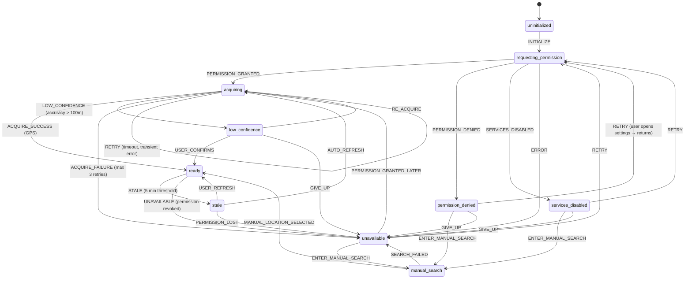

# W1 — Location Workflow Specification

## Overview

| Field | Value |
|-------|-------|
| **Workflow ID** | W1 |
| **Name** | Location Establishment |
| **Spec Sections** | §2-3, §66, §91, §104-105 |
| **State Machine** | 9 states (see below) |
| **Entry Point** | App launch (`/`) — root-level gate |
| **Exit Point** | Location `ready` → `/trip` (T01 empty state) |

---

## State Machine Diagram



### State Definitions

| State | Description | UI Rendered | Next Actions |
|-------|-------------|-------------|--------------|
| `uninitialized` | App just launched, no checks done | Full-page spinner | → `requesting_permission` |
| `requesting_permission` | Checking `navigator.permissions` | Full-page spinner | → `acquiring` / `permission_denied` / `services_disabled` / `unavailable` |
| `acquiring` | `getCurrentPosition()` in progress | `LocationAcquisitionState` (L02) — pulsing GPS icon + three-dots animation + "Obteniendo tu ubicación…" | → `ready` / `low_confidence` / `unavailable` |
| `low_confidence` | GPS accuracy > 100m | `LocationRecoveryPanel` (L03, reason=low_confidence) — "Ubicación imprecisa" + retry | → `ready` / `acquiring` / `unavailable` |
| `ready` | Location established (GPS or manual) | **Gate opens** — children render | → `stale` (after 5 min) / `unavailable` |
| `stale` | Location > 5 min old | `LocationRecoveryPanel` (L03, reason=stale) — "Ubicación desactualizada" + refresh | → `acquiring` / `ready` / `unavailable` |
| `permission_denied` | User denied geolocation | `LocationRecoveryPanel` (L03, reason=permission_denied) — "Permiso denegado" + manual search + settings link | → `manual_search` / `requesting_permission` / `unavailable` |
| `services_disabled` | GPS off at system level | `LocationRecoveryPanel` (L03, reason=services_disabled) — "GPS desactivado" + manual search + settings link | → `manual_search` / `requesting_permission` / `unavailable` |
| `manual_search` | User searching place name | `LocationRecoveryPanel` with `LocationSearchInput` expanded | → `ready` / `unavailable` |
| `unavailable` | All else failed | `LocationRecoveryPanel` (L03, reason=unavailable) — generic recovery + manual search | → `manual_search` / `requesting_permission` / `acquiring` |

---

## Component Catalog (Spec §5)

| Component ID | Name | Responsibility | Location |
|--------------|------|----------------|----------|
| `LOC-GATE-01` | `LocationGate` | Root-level infrastructure gate; orchestrates state machine, renders L01/L02/L03 inline | `src/components/location/LocationGate.tsx` |
| `LOC-PROMPT-01` | `LocationPermissionPrompt` | L01: Explains why location needed, primary CTA "Permitir ubicación", manual search entry, secondary "Configuración del sistema" | `src/components/location/LocationPermissionPrompt.tsx` |
| `LOC-ACQ-01` | `LocationAcquisitionState` | L02: Animated GPS acquisition with pulsing icon, three-dots animation, "Obteniendo tu ubicación…" | `src/components/location/LocationAcquisitionState.tsx` |
| `LOC-ACQ-DOTS-01` | `LocationAcquisitionDots` | Inline three-dots loading animation (used in L01→L02 transition and L02) | `src/components/location/LocationAcquisitionDots.tsx` |
| `LOC-REC-01` | `LocationRecoveryPanel` | L03: Unified recovery for all error states; shows reason-specific copy + manual search entry | `src/components/location/LocationRecoveryPanel.tsx` |
| `LOC-SEARCH-01` | `LocationSearchInput` | Manual search input with debounced Mapbox Geocoding API, MX/US only | `src/components/location/LocationSearchInput.tsx` |
| `LOC-SUGGEST-01` | `LocationSearchSuggestions` | Nearby suggestion chips below search input | `src/components/location/LocationSearchSuggestions.tsx` |
| `LOC-CONF-01` | `LocationConfidenceIndicator` | Inline badge showing confidence: GPS (high/🟢) / Manual (low/🟡) / Low (>100m/🟠) | `src/components/location/LocationConfidenceIndicator.tsx` |
| `LOC-STATUS-01` | `LocationStatusBanner` | **Transient banner** (user-dismissible, slides up) on success: "Ubicación establecida: Tijuana, BC" | `src/components/location/LocationStatusBanner.tsx` |
| `LOC-NET-01` | `useNetworkStatus` | Hook detecting online/reachable state; disables search when offline | `src/lib/network-status.ts` |
| `TR-EMPTY-01` | `TripEmptyActionPanel` | T01: "¿A dónde vas?" + `[ Comenzar un viaje ]` + `Ver todos los cruces →` | `src/components/trip/TripEmptyActionPanel.tsx` |
| `TR-NEAR-01` | `TripNearbyCrossingsSection` | T01: "CERCA DE TI" header + "Cruces relevantes ahora" subtitle + 3 cards + `Ver todos los cruces →` | `src/components/trip/TripNearbyCrossingsSection.tsx` |
| `TR-NEAR-02` | `TripNearbyCrossingRow` | T01: Crossing card with name, wait time, status badge (● Abierto/● Cerrado/● Limitado), direction (Norte/Sur), freshness ("Actualizado hace X min") | `src/components/trip/TripNearbyCrossingRow.tsx` |

---

## ASCII Screen Diagrams

### L01 — Permission Prompt (Spec §2)

```text
┌─────────────────────────────────────────┐
│                                         │
│              ¿Dónde estás?              │
│                                         │
│  Cruze necesita tu ubicación para       │
│  encontrar los cruces relevantes.       │
│                                         │
│  ┌─────────────────────────────────┐    │
│  │  📍  Permitir ubicación         │    │  ← Primary CTA (LOC-PROMPT-01)
│  └─────────────────────────────────┘    │
│                                         │
│  ┌─────────────────────────────────┐    │
│  │ 🔍  Buscar ubicación            │    │  ← Manual search entry (LOC-PROMPT-01)
│  └─────────────────────────────────┘    │
│                                         │
│  ┌─────────────────────────────────┐    │
│  │  ⚙  Configuración del sistema   │    │  ← Secondary (opens iOS/Android settings)
│  └─────────────────────────────────┘    │
│                                         │
└─────────────────────────────────────────┘
```

### L02 — Acquisition (Spec §3)

```text
┌─────────────────────────────────────────┐
│                                         │
│              📍                         │
│              (pulsing animation)        │
│                                         │
│        Obteniendo tu ubicación…         │
│                                         │
│        ●  ●  ●                          │  ← Three-dots animation (LOC-ACQ-DOTS-01)
│                                         │
└─────────────────────────────────────────┘
```

### L03 — Recovery with Manual Search (Spec §3.2)

```text
┌─────────────────────────────────────────┐
│                                         │
│     No se pudo obtener tu               │
│     ubicación por GPS.                  │
│                                         │
│  ┌─────────────────────────────────┐    │
│  │ 🔍  Buscar ubicación...         │    │  ← LOC-SEARCH-01 (expands on focus)
│  └─────────────────────────────────┘    │
│                                         │
│  LOC-SUGGEST-01                         │
│  ▸ Tijuana, BC                          │
│  ▸ Mexicali, BC                         │
│  ▸ San Luis Río Colorado, SON           │
│                                         │
│  ─────────── o ───────────              │
│                                         │
│  ┌─────────────────────────────────┐    │
│  │  🔄  Reintentar GPS             │    │  ← Retry acquisition
│  └─────────────────────────────────┘    │
│                                         │
│  ┌─────────────────────────────────┐    │
│  │  ⚙  Configuración del sistema   │    │  ← Opens system settings
│  └─────────────────────────────────┘    │
│                                         │
│  [ Sin conexión a internet ]            │  ← Shown when offline (LOC-NET-01)
│                                         │
└─────────────────────────────────────────┘
```

### L03 — Recovery: Permission Denied (variant)

```text
┌─────────────────────────────────────────┐
│                                         │
│     Permiso de ubicación                │
│     denegado.                           │
│                                         │
│  Cruze no puede funcionar sin saber     │
│  dónde estás.                           │
│                                         │
│  ┌─────────────────────────────────┐    │
│  │ 🔍  Buscar ubicación...         │    │  ← Manual search entry
│  └─────────────────────────────────┘    │
│                                         │
│  ─────────── o ───────────              │
│                                         │
│  ┌─────────────────────────────────┐    │
│  │  ⚙  Abrir configuración         │    │  ← Deep-link to app settings
│  └─────────────────────────────────┘    │
│                                         │
│  ┌─────────────────────────────────┐    │
│  │  🔄  Reintentar                 │    │  ← Re-check permission
│  └─────────────────────────────────┘    │
└─────────────────────────────────────────┘
```

### Post-Acquisition Banner (LOC-STATUS-01)

```text
┌─────────────────────────────────────────┐  ← Fixed bottom, slides up
│  ✓  Ubicación establecida:              │
│     Tijuana, BC                         │
│  [ ✕ ]                                  │  ← User dismisses (not auto-dismiss)
└─────────────────────────────────────────┘
```

---

## Preconditions

| Precondition | Check | Failure Handling |
|--------------|-------|------------------|
| Browser supports Geolocation API | `navigator.geolocation` exists | `unavailable` state |
| Browser supports Permissions API | `navigator.permissions` exists | Fallback to `"prompt"` |
| Network reachable (for manual search) | `navigator.onLine` + `fetch("/api/health")` | Disable `LOC-SEARCH-01`, show offline banner |
| HTTPS context (required for GPS) | `location.protocol === "https:"` or `localhost` | `unavailable` if HTTP |

---

## Postconditions

| On Success (`ready`) | On Failure (`unavailable`) |
|----------------------|----------------------------|
| `location` object in store: `{ lat, lng, accuracy, timestamp, confidence, placeName?, isManual? }` | User at L03 with all recovery options |
| `isManual: false` (GPS) or `true` (manual search) | `isManual: false` |
| `state = "ready"` | `state = "unavailable"` |
| Root gate opens → renders `/trip` (T01) | User must manually resolve |

---

## Data Structures

### LocationData (store + state machine)

```typescript
interface LocationData {
  lat: number;
  lng: number;
  accuracy: number;        // meters
  timestamp: number;       // Date.now()
  confidence: LocationConfidence; // "ready" | "needs_confirmation" | "needs_refreshing" | "determining" | "unavailable"
  // Added by store:
  isManual?: boolean;      // true if from manual search
  placeName?: string;      // Reverse-geocoded or searched place name
}
```

### LocationStore (Zustand + persist)

```typescript
interface LocationStore {
  state: LocationState;
  location: LocationData | null;
  isManual: boolean;
  error: string | null;
  setState: (state: LocationState) => void;
  setLocation: (location: LocationData | null, isManual?: boolean) => void;
  setError: (error: string | null) => void;
  reset: () => void;
}
```

Persisted key: `cruze-location` (localStorage)

---

## API Integration

### GPS Acquisition
```typescript
// src/lib/geolocation.ts
requestGeolocation(): Promise<{ lat, lng, accuracy }>
// Options: enableHighAccuracy=true, timeout=10000, maximumAge=300000
```

### Permission Check
```typescript
checkGeolocationPermission(): Promise<PermissionState>
// Returns: "granted" | "denied" | "prompt"
```

### Reverse Geocode (post-GPS)
```typescript
// src/lib/geocoding.ts
reverseGeocode(lat: number, lng: number): Promise<Place | null>
// Calls Mapbox Geocoding API: /mapbox.places/{lng},{lat}.json
// Returns Place with name, formattedAddress, country (MX/US)
```

### Manual Search
```typescript
// src/lib/geocoding.ts
searchLocations(query: string, limit=5): Promise<GeocodingResult[]>
// Calls Mapbox: /mapbox.places/{query}.json?country=mx,us&types=place,region
// Returns { id, placeName, center: [lng, lat], context: string[] }
```

---

## Error Handling Matrix

| Error Scenario | State Transition | User Message | Recovery |
|----------------|------------------|--------------|----------|
| `PERMISSION_DENIED` | `permission_denied` | "Permiso denegado" | Manual search / Open settings |
| `POSITION_UNAVAILABLE` | `unavailable` | "Ubicación no disponible" | Retry / Manual search |
| `TIMEOUT` (10s) | `unavailable` | "Tiempo agotado" | Retry / Manual search |
| `SERVICE_DISABLED` | `services_disabled` | "GPS desactivado" | Manual search / Open settings |
| Network offline (manual search) | N/A (inline) | "Sin conexión a internet" | Wait for online |
| Mapbox API error | `unavailable` | "Error de búsqueda" | Retry / Manual entry |
| Reverse geocode fails | `ready` (no placeName) | None (coords only) | Show coords fallback |

---

## i18n Keys (es/en)

### Location Permission (L01)
| Key | ES | EN |
|-----|-----|-----|
| `onboarding.location.title` | "¿Dónde estás?" | "Where are you?" |
| `onboarding.location.subtitle` | "Cruze necesita tu ubicación para encontrar los cruces relevantes." | "Cruze needs your location to find relevant crossings." |
| `onboarding.location.allow` | "Permitir ubicación" | "Allow location" |
| `onboarding.location.manualSearch` | "Buscar ubicación" | "Search location" |
| `onboarding.location.settings` | "Configuración del sistema" | "System settings" |

### Acquisition (L02)
| Key | ES | EN |
|-----|-----|-----|
| `onboarding.location.acquiring` | "Obteniendo tu ubicación…" | "Getting your location…" |

### Recovery (L03) — Common
| Key | ES | EN |
|-----|-----|-----|
| `onboarding.location.recovery.retry` | "Reintentar GPS" | "Retry GPS" |
| `onboarding.location.recovery.manualSearch` | "Buscar ubicación" | "Search location" |
| `onboarding.location.recovery.settings` | "Configuración del sistema" | "System settings" |
| `onboarding.location.recovery.offline` | "Sin conexión a internet" | "No internet connection" |
| `onboarding.location.recovery.offlineDesc` | "La búsqueda requiere conexión" | "Search requires connection" |
| `onboarding.location.recovery.noResults` | "No se encontraron resultados" | "No results found" |
| `onboarding.location.recovery.searchPlaceholder` | "Buscar ciudad o cruce..." | "Search city or crossing..." |

### Recovery — Specific Reasons
| Key | ES | EN |
|-----|-----|-----|
| `onboarding.location.recovery.permissionDenied` | "Permiso de ubicación denegado" | "Location permission denied" |
| `onboarding.location.recovery.permissionDeniedDesc` | "Cruze no puede funcionar sin saber dónde estás. Puedes buscar tu ubicación manualmente o habilitar el permiso en la configuración." | "Cruze can't work without knowing where you are. You can search manually or enable permission in settings." |
| `onboarding.location.recovery.servicesDisabled` | "GPS desactivado" | "GPS disabled" |
| `onboarding.location.recovery.servicesDisabledDesc` | "El GPS del dispositivo está apagado. Actívalo en la configuración o busca tu ubicación manualmente." | "Device GPS is off. Turn it on in settings or search manually." |
| `onboarding.location.recovery.lowConfidence` | "Ubicación imprecisa" | "Low location accuracy" |
| `onboarding.location.recovery.lowConfidenceDesc` | "Tu ubicación tiene baja precisión (>100m). ¿Quieres reintentar o buscar manualmente?" | "Your location has low accuracy (>100m). Want to retry or search manually?" |
| `onboarding.location.recovery.stale` | "Ubicación desactualizada" | "Location outdated" |
| `onboarding.location.recovery.staleDesc` | "Tu ubicación tiene más de 5 minutos. ¿Quieres actualizarla?" | "Your location is over 5 minutes old. Want to refresh?" |
| `onboarding.location.recovery.unavailable` | "No se pudo obtener la ubicación" | "Could not get location" |
| `onboarding.location.recovery.unavailableDesc` | "Ocurrió un error inesperado. Puedes reintentar o buscar tu ubicación manualmente." | "An unexpected error occurred. You can retry or search manually." |

### Status Banner
| Key | ES | EN |
|-----|-----|-----|
| `onboarding.location.banner.established` | "Ubicación establecida: {placeName}" | "Location set: {placeName}" |

---

## Integration Points

| Workflow | Integration |
|----------|-------------|
| **W2-W5 Trip Setup** | Requires `state === "ready"` before user can select destination; T03 Origin uses `location` for reverse geocode |
| **W6 Active Trip** | Uses `location` for "Cerca de ti" nearby crossings on T01 empty state |
| **W7 Crossings** | `/crossings` directory sorts by distance from `location` |
| **W8 Agent** | Agent context includes `location` for relevant answers |
| **W9 Avisos** | Filters alerts by user's location corridor |
| **T01 Trip Empty** | Location gate opens → renders `/trip` with `LOC-STATUS-01` banner, `TR-EMPTY-01` (DestinationSearch), `TR-NEAR-01`/`TR-NEAR-02` nearby crossings |

---

## Test Scenarios

| ID | Scenario | Expected |
|----|----------|----------|
| W1.1 | Fresh launch, GPS granted, high accuracy | `uninitialized` → `requesting_permission` → `acquiring` → `ready` → `/trip` (T01) |
| W1.2 | Fresh launch, GPS granted, low accuracy | `acquiring` → `low_confidence` → user confirms → `ready` |
| W1.3 | Fresh launch, GPS denied | `requesting_permission` → `permission_denied` → L03 with manual search |
| W1.4 | GPS denied → manual search "Tijuana" | `permission_denied` → `manual_search` → select → `ready` (isManual=true) |
| W1.5 | GPS off (system) | `services_disabled` → L03 with manual search |
| W1.6 | GPS timeout (10s) | `acquiring` → `unavailable` → L03 |
| W1.7 | Returning user, location persisted | `ready` immediately (no UI) → `/trip` (T01) |
| W1.8 | Returning user, location stale (>5min) | `ready` → auto-refresh → `acquiring` → `ready` |
| W1.9 | Offline + manual search attempted | L03 shows "Sin conexión", search disabled |
| W1.10 | Permission revoked after ready | `ready` → `unavailable` → L03 on next navigation |
| W1.11 | T01: Location acquired → shows LOC-STATUS-01 banner (non-dismissible) | `ready` → `/trip` shows banner with placeName |
| W1.12 | T01: User searches destination in target country | Search input filters to US (from MX) or MX (from US) |
| W1.13 | T01: User selects destination → Next → /trip/setup with dest pre-filled | Selection → Next enabled → navigates to /trip/setup?dest=... |
| W1.14 | T01: Nearby crossings show status, direction, freshness | TR-NEAR-02 cards show badge, Norte/Sur, "Actualizado hace X min" |

---

## Stale Threshold Clarification

| Threshold | Value | Purpose | Code Constant |
|-----------|-------|---------|---------------|
| **Location stale** | **5 min** (300,000ms) | GPS freshness trigger for auto-refresh | `LOCATION_STALE_THRESHOLD_MS = 5 * 60 * 1000` |
| **Trip data stale** | **12 hours** | Trip recommendation freshness for "trip may be outdated" banner | `TRIP_STALENESS_THRESHOLD_MS = 12 * 60 * 60 * 1000` |

---

## Files Reference

| File | Purpose |
|------|---------|
| `src/components/location/LocationGate.tsx` | Root gate (LOC-GATE-01) |
| `src/components/location/LocationPermissionPrompt.tsx` | L01 (LOC-PROMPT-01) — with manual search button |
| `src/components/location/LocationAcquisitionState.tsx` | L02 (LOC-ACQ-01) — uses three-dots animation |
| `src/components/location/LocationAcquisitionDots.tsx` | Three-dots animation (LOC-ACQ-DOTS-01) |
| `src/components/location/LocationRecoveryPanel.tsx` | L03 (LOC-REC-01) — with manual search |
| `src/components/location/LocationSearchInput.tsx` | Manual search (LOC-SEARCH-01) |
| `src/components/location/LocationSearchSuggestions.tsx` | Suggestions (LOC-SUGGEST-01) |
| `src/components/location/LocationConfidenceIndicator.tsx` | Confidence badge (LOC-CONF-01) |
| `src/components/location/LocationStatusBanner.tsx` | Transient banner (LOC-STATUS-01) — user-dismissible |
| `src/components/trip/TripEmptyActionPanel.tsx` | T01 action panel (TR-EMPTY-01) |
| `src/components/trip/TripNearbyCrossingsSection.tsx` | T01 nearby section (TR-NEAR-01) |
| `src/components/trip/TripNearbyCrossingRow.tsx` | T01 crossing card (TR-NEAR-02) |
| `src/lib/geolocation.ts` | GPS primitives |
| `src/lib/geocoding.ts` | Mapbox search + reverse geocode |
| `src/lib/network-status.ts` | Online/reachable hook |
| `src/lib/location-state-machine.ts` | 9-state FSM |
| `src/stores/location.ts` | Zustand + persist |
| `src/app/[locale]/layout.tsx` | Root layout with RootGate |
| `src/app/[locale]/RootGate.tsx` | Client wrapper for LocationGate |
| `src/app/[locale]/(main)/trip/page.tsx` | T01 empty state (post-gate) |

---

## Updated Spec Alignment

### Changes from v1
1. **L01 Updated**: Added "Buscar ubicación" button to `LocationPermissionPrompt` (direct manual search entry)
2. **L02 Updated**: Removed circular spinner, uses `LOC-ACQ-DOTS-01` three-dots animation
3. **L03 Updated**: Manual search available in all recovery states
4. **New Components**: `LOC-ACQ-DOTS-01`, `LOC-CONF-01`, `LOC-STATUS-01`, `TR-EMPTY-01`, `TR-NEAR-01`, `TR-NEAR-02`
5. **LOC-STATUS-01**: Changed from auto-dismiss (3s) to **user-dismissible** transient banner
6. **Root Gate**: Moved to `[locale]/layout.tsx` via `RootGate` wrapper; excludes `/settings`, `/crossing/*`, `/test-index`
7. **Stale Thresholds**: Clarified 5min (location) vs 12h (trip data) — both kept
8. **Public Routes**: Removed `/onboarding/` (deleted)
9. **T01 Spec Compliance**: Implemented `TR-EMPTY-01`, `TR-NEAR-01`, `TR-NEAR-02` with status badge, direction, freshness