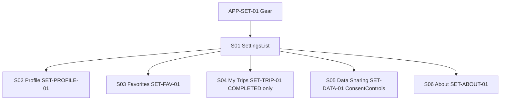

# W10 — Settings Workflow Specification
**Version:** 1.1 — 2026-09-04 — W5 canon 1.1 (radii 4/8/12/16/20, nav 56/80+safe). If version differs, revisit testing per `design/TESTING_INTEGRATION_PLAN.md:11` + `docs/TESTING_TOOLS.md`.

## Overview
| Field | Value |
|-------|-------|
| **Workflow ID** | W10 |
| **Name** | Settings Root → Profile / Favorites / My Trips / Data Sharing / About |
| **Spec Sections** | §10-11, §47-50, §104 |
| **Pages** | S01 → S02/S03/S04/S05/S06 |
| **Branching** | Hub → 5 leaves isolated by design |

## Flow Diagram

## Page Sequence
| Step | Page ID | Page | Key Actions | Next |
|------|---------|------|-------------|------|
| 1 | S01 | Root | SET-ROOT-01 + SET-SEC-01 PERFIL/GUARDADOS/PRIVACIDAD/INFORMACIÓN | → S02-S06 |
| 2 | S02 | Profile | Travel Mode Access Document Trusted Traveler no numbers | End |
| 3 | S03 | Favorites | Saved crossings San Luis/Lukeville/Nogales via CR-DET-09 | End |
| 4 | S04 | My Trips | COMPLETED only Puerto Peñasco→Los Angeles | End |
| 5 | S05 | Data Sharing | Granular consent toggles (contribution/ads/analytics) + revocation note + policy version | End |
| 6 | S06 | About | Términos Privacidad Legal Fuentes Versión | End |

## Component Catalog
| Component ID | Name | Responsibility |
|--------------|------|----------------|
| SET-ROOT-01 | SettingsList | Root container |
| SET-SEC-01 | SettingsSection | Section divider |
| SET-PROFILE-01 | ProfileSettings | Local profile |
| SET-FAV-01 | FavoriteCrossingsList | Saved crossings |
| SET-TRIP-01 | SavedTripsList | Mis viajes COMPLETED only |
| SET-DATA-01 | DataSharingControls | Versioned consent toggles |
| SET-ABOUT-01 | AboutLinksList | Legal surface |

## Files Reference
| File | Purpose |
|------|---------|
| src/app/[locale]/settings/page.tsx | S01 |
| src/app/[locale]/settings/profile/page.tsx | S02 |
| src/app/[locale]/settings/favorites/page.tsx | S03 |
| src/app/[locale]/settings/trips/page.tsx | S04 |
| src/app/[locale]/settings/data-sharing/page.tsx | S05 |
| src/app/[locale]/settings/about/page.tsx | S06 |