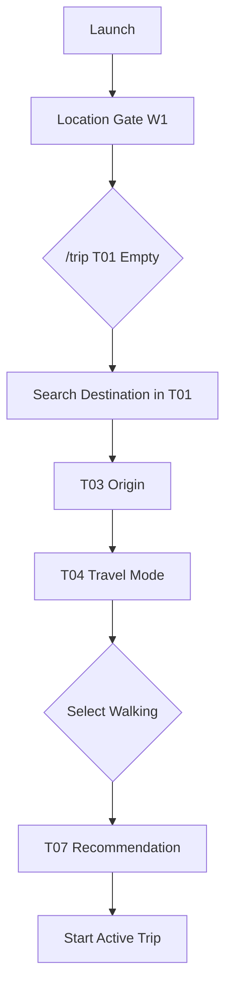

# W2 — Trip Walking Workflow Specification

## Overview

| Field | Value |
|-------|-------|
| **Workflow ID** | W2 |
| **Name** | Trip Setup — Walking |
| **Spec Sections** | §17, §105 |
| **Pages** | T01 (DestinationSearch) → T03 → T04(walking) → T07 |
| **Branching** | Minimal — no vehicle access, no documents |

---

## Flow Diagram



---

## Page Sequence

| Step | Page ID | Page | Key Actions | Next |
|------|---------|------|-------------|------|
| 1 | T01 | Destination Search | Search/select destination in T01 (inline) | → T03 |
| 2 | T03 | Origin | Use current location (GPS) or search | → T04 |
| 3 | T04 | Travel Mode | Select "A pie" (Walking) | → T07 |
| 4 | T07 | Recommendation | Show crossing rec for pedestrians | → Active Trip |

---

## Component Catalog

| Component ID | Name | Responsibility |
|--------------|------|----------------|
| `TR-EMPTY-01` | `TripDestinationSearch` | T01: Destination search with Mapbox, country filter (US from MX) |
| `TR-SETUP-02` | `TripSetupOriginStep` | Origin: GPS button + manual search |
| `TR-SETUP-03` | `TripSetupTravelModeStep` | Radio: Walking / Private / Commercial |
| `TR-REC-01` | `TripRecommendationPrimaryCard` | Primary crossing rec for pedestrians |
| `TR-REC-02` | `TripRecommendationReasonList` | Why this crossing |
| `TR-REC-03` | `TripAlternativeListSection` | Other pedestrian crossings |

---

## Screen ASCII

### T01 — Destination Search (Inline in T01)

```text
┌─────────────────────────────────────────┐
│ [APP-HEAD-01] CRUZE       🔔    ⚙       │
├─────────────────────────────────────────┤
│                                         │
│ [LOC-STATUS-01]  ✓ Tijuana, BC          │
│                                         │
│ TU VIAJE                                │
│                                         │
│ ¿A dónde vas?                           │
│                                         │
│ ┌─────────────────────────────────┐     │
│ │ 🔍  Buscar destino en EE.UU...  │     │  ← Country-filtered (MX→US)
│ └─────────────────────────────────┘     │
│                                         │
│          [ Siguiente ]                  │  ← Disabled until selection
│                                         │
│─────────────────────────────────────────│
│                                         │
│ [TR-NEAR-01]                            │
│ CERCA DE TI                             │
│ Cruces relevantes ahora                 │
│                                         │
│ [TR-NEAR-02] San Luis       11 min      │
│ ● Abierto  Norte  Actualizado 2 min     │
│                                         │
│ [TR-NEAR-02] Lukeville      18 min      │
│ ● Abierto  Norte  Actualizado 3 min     │
│                                         │
│ [TR-NEAR-02] Nogales        24 min      │
│ ● Abierto  Norte  Actualizado 2 min     │
│                                         │
│          Ver todos los cruces →         │
│                                         │
├─────────────────────────────────────────┤
│ [APP-NAV-01] Viaje | Cruces | Agente    │
└─────────────────────────────────────────┘
```

### T03 — Origin (Walking)

```text
┌─────────────────────────────────────────┐
│           ← Atrás                       │
│                                         │
│          ¿Desde dónde sales?            │
│                                         │
│  ┌─────────────────────────────────┐   │
│  │ 📍  Usar mi ubicación actual    │   │ ← Primary (GPS)
│  │     Usaremos tu punto...        │   │
│  └─────────────────────────────────┘   │
│                                         │
│  ──────── o ────────                    │
│                                         │
│  ┌─────────────────────────────────┐   │
│  │ 🔍  Ingresar punto de partida   │   │
│  └─────────────────────────────────┘   │
│                                         │
└─────────────────────────────────────────┘
```

### T04 — Travel Mode (Walking Selected)

```text
┌─────────────────────────────────────────┐
│           ← Atrás                       │
│                                         │
│          ¿CÓMO VIAJAS?                  │
│                                         │
│  ┌─────────────────────────────────┐   │
│  │  👟  A pie                      │   │ ← SELECTED
│  │     Cruce peatonal              │   │
│  └─────────────────────────────────┘   │
│                                         │
│  ┌─────────────────────────────────┐   │
│  │  🚗  Vehículo personal          │   │
│  └─────────────────────────────────┘   │
│                                         │
│  ┌─────────────────────────────────┐   │
│  │  🚛  Vehículo comercial         │   │
│  └─────────────────────────────────┘   │
│                                         │
└─────────────────────────────────────────┘
```

### T07 — Pedestrian Recommendation

```text
┌─────────────────────────────────────────┐
│              RECOMENDADO                │
│                                         │
│  San Ysidro Peatonal                    │
│  🟢 15 min  │  45 min total            │
│                                         │
│  ✦ MEJOR OPCIÓN                         │
│  Peatonal dedicado, menor espera        │
│                                         │
│  ALTERNATIVAS                           │
│  Otay Mesa Peatonal    22 min  +7       │
│  Tecate Peatonal       30 min  +15      │
│                                         │
│  ┌─────────────────────────────────┐   │
│  │      INICIAR VIAJE              │   │
│  └─────────────────────────────────┘   │
└─────────────────────────────────────────┘
```

---

## Data Requirements

| Step | Required Data | Source |
|------|---------------|--------|
| T01 | Destination `Place` (name, lat, lng, country) | Mapbox search / recent, filtered to target country |
| T03 | Origin `Place` (name, lat, lng, country) | GPS reverse geocode / search |
| T04 | Travel mode = "walking" | User selection |
| T07 | CrossingRecommendation (pedestrian-only) | API filtered by `pedestrianAllowed=true` |

---

## Preconditions

- Location established (W1 complete, state = `ready`)
- User lands on `/trip` (T01) after location gate

---

## Postconditions

- Trip store populated: `destination`, `origin`, `travelMode: "walking"`
- Recommendation fetched for pedestrian crossings
- User can start active trip

---

## Error Handling

| Scenario | Handling |
|----------|----------|
| GPS fails at T03 | Show manual search fallback |
| No pedestrian crossings found | Show "No hay cruces peatonales" + suggest nearby |
| API timeout at T07 | Retry + cached fallback |

---

## Integration Points

- **W1 Location**: Uses `location` store for T01 search filter and T03 GPS
- **W6 Active Trip**: Consumes `destination`, `origin`, `recommendedCrossing`
- **W7 Crossings**: Pedestrian filter applies

---

## Files Reference

| File | Purpose |
|------|---------|
| `src/components/trip/DestinationSearch.tsx` | T01 inline destination search |
| `src/components/trip/TripSetupOriginStep.tsx` | T03 |
| `src/components/trip/TripSetupTravelModeStep.tsx` | T04 |
| `src/app/[locale]/(main)/trip/page.tsx` | T01 with embedded search |
| `src/app/[locale]/(main)/trip/setup/page.tsx` | T03 (re-entry) |
| `src/app/[locale]/(main)/trip/recommendation/page.tsx` | T07 |
| `src/lib/trip-setup-flow.ts` | Flow logic |
| `src/lib/destination-filter.ts` | Country detection + filtering |