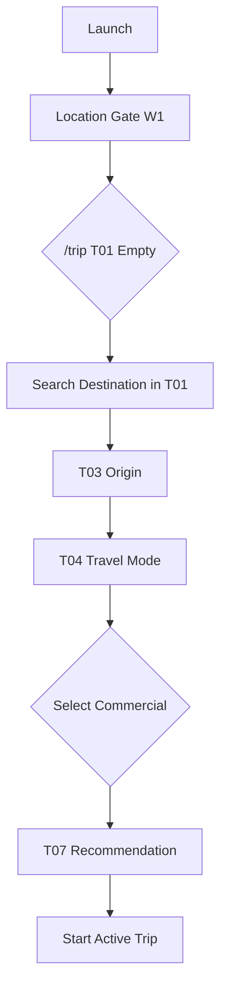

# W3 — Trip Commercial Workflow Specification
**Version:** 1.1 — 2026-09-04 — W5 canon 1.1 (radii 4/8/12/16/20, nav 56/80+safe). If version differs, revisit testing per `design/TESTING_INTEGRATION_PLAN.md:11` + `docs/TESTING_TOOLS.md`.

## Overview

| Field | Value |
|-------|-------|
| **Workflow ID** | W3 |
| **Name** | Trip Setup — Commercial Vehicle |
| **Spec Sections** | §18, §105 |
| **Pages** | T01 (DestinationSearch) → T03 → T04(commercial) → T07 |
| **Branching** | Filters to commercial-allowed crossings only |

---

## Flow Diagram



---

## Page Sequence

| Step | Page ID | Page | Key Actions | Next |
|------|---------|------|-------------|------|
| 1 | T01 | Destination Search | Search/select destination in T01 (inline) | → T03 |
| 2 | T03 | Origin | GPS or search | → T04 |
| 3 | T04 | Travel Mode | Select "Vehículo comercial" | → T07 |
| 4 | T07 | Recommendation | Commercial-only crossings | → Active Trip |

---

## Component Catalog

| Component ID | Name | Responsibility |
|--------------|------|----------------|
| `TR-EMPTY-01` | `TripDestinationSearch` | T01: Destination search with Mapbox, country filter |
| `TR-SETUP-02` | `TripSetupOriginStep` | Origin: GPS + search |
| `TR-SETUP-03` | `TripSetupTravelModeStep` | Radio: Walking / Private / Commercial |
| `TR-REC-01` | `TripRecommendationPrimaryCard` | Primary commercial crossing |
| `TR-REC-02` | `TripRecommendationReasonList` | Why this crossing |
| `TR-REC-03` | `TripAlternativeListSection` | Other commercial crossings |

---

## Screen ASCII

### T01 — Destination Search (Inline in T01)

```text
┌─────────────────────────────────────────┐
│ [APP-HEAD-01] CRUZE       🔔    ⚙       │
├─────────────────────────────────────────┤
│                                         │
│ [LOC-STATUS-01]  ✓ San Diego, CA        │
│                                         │
│ TU VIAJE                                │
│                                         │
│ ¿A dónde vas?                           │
│                                         │
│ ┌─────────────────────────────────┐     │
│ │ 🔍  Buscar destino en México... │     │  ← Country-filtered (US→MX)
│ └─────────────────────────────────┘     │
│                                         │
│          [ Siguiente ]                  │  ← Disabled until selection
│                                         │
│─────────────────────────────────────────│
│                                         │
│ [TR-NEAR-01]                            │
│ CERCA DE TI                             │
│ Cruces relevantes ahora                 │
│                                         │
│ [TR-NEAR-02] San Luis       11 min      │
│ ● Abierto  Norte  Actualizado 2 min     │
│                                         │
│ [TR-NEAR-02] Lukeville      18 min      │
│ ● Abierto  Norte  Actualizado 3 min     │
│                                         │
│ [TR-NEAR-02] Nogales        24 min      │
│ ● Abierto  Norte  Actualizado 2 min     │
│                                         │
│          Ver todos los cruces →         │
│                                         │
├─────────────────────────────────────────┤
│ [APP-NAV-01] Viaje | Cruces | Agente    │
└─────────────────────────────────────────┘
```

### T04 — Travel Mode (Commercial Selected)

```text
┌─────────────────────────────────────────┐
│           ← Atrás                       │
│                                         │
│          ¿CÓMO VIAJAS?                  │
│                                         │
│  ┌─────────────────────────────────┐   │
│  │  👟  A pie                      │   │
│  └─────────────────────────────────┘   │
│                                         │
│  ┌─────────────────────────────────┐   │
│  │  🚗  Vehículo personal          │   │
│  └─────────────────────────────────┘   │
│                                         │
│  ┌─────────────────────────────────┐   │
│  │  🚛  Vehículo comercial         │   │ ← SELECTED
│  │     Cruce de carga              │   │
│  └─────────────────────────────────┘   │
│                                         │
└─────────────────────────────────────────┘
```

### T07 — Commercial Recommendation

```text
┌─────────────────────────────────────────┐
│              RECOMENDADO                │
│                                         │
│  Otay Mesa Comercial                    │
│  🟢 25 min  │  55 min total            │
│                                         │
│  ✦ MEJOR OPCIÓN                         │
│  Carril FAST, 24/7 operación            │
│                                         │
│  ALTERNATIVAS                           │
│  Calexico Oeste Com.  35 min  +10       │
│  Tecate Comercial       40 min  +15     │
│                                         │
│  ⚠  Solo cruces con commercialAccess    │
│                                         │
│  ┌─────────────────────────────────┐   │
│  │      INICIAR VIAJE              │   │
│  └─────────────────────────────────┘   │
└─────────────────────────────────────────┘
```

---

## Data Requirements

| Step | Required Data | Source |
|------|---------------|--------|
| T01 | Destination `Place` | Mapbox / recent, filtered to target country |
| T03 | Origin `Place` | GPS / search |
| T04 | Travel mode = "commercial" | User selection |
| T07 | CrossingRecommendation (commercialAllowed=true) | API filtered |

---

## Commercial-Specific Logic

- **Filter**: Only crossings with `commercialAllowed: true` in API response
- **Lanes**: Show commercial lane wait times (FAST, standard commercial)
- **Hours**: Highlight 24/7 vs limited hours
- **Documents**: No document profile step (unlike private northbound)

---

## Preconditions

- Location established (W1 complete)
- User lands on `/trip` (T01) after location gate

---

## Postconditions

- Trip store: `travelMode: "commercial"`
- Recommendation filtered to commercial crossings

---

## Error Handling

| Scenario | Handling |
|----------|----------|
| No commercial crossings | "No hay cruces comerciales" + suggest nearest |
| API timeout | Retry + cached |

---

## Integration Points

- **W1**: Uses location for origin
- **W6**: Consumes commercial trip data

---

## Files Reference

| File | Purpose |
|------|---------|
| `src/components/trip/DestinationSearch.tsx` | T01 inline destination search |
| `src/components/trip/TripSetupOriginStep.tsx` | T03 |
| `src/components/trip/TripSetupTravelModeStep.tsx` | T04 |
| `src/app/[locale]/(main)/trip/page.tsx` | T01 with embedded search |
| `src/app/[locale]/(main)/trip/setup/page.tsx` | T03 (re-entry) |
| `src/app/[locale]/(main)/trip/recommendation/page.tsx` | T07 |
| `src/lib/trip-setup-flow.ts` | Flow logic |
| `src/lib/destination-filter.ts` | Country detection + filtering |