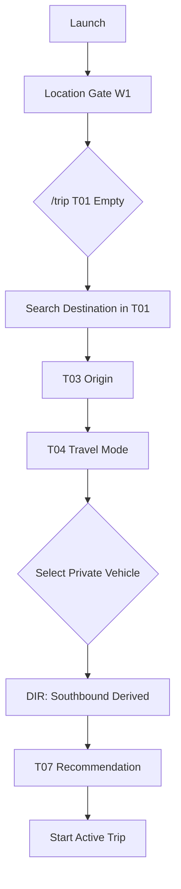

# W4 — Trip Private Southbound Workflow Specification

## Overview

| Field | Value |
|-------|-------|
| **Workflow ID** | W4 |
| **Name** | Trip Setup — Private Vehicle Southbound (US → MX) |
| **Spec Sections** | §19, §105 |
| **Pages** | T01 (DestinationSearch) → T03 → T04(private) → DIR(south) → T07 |
| **Branching** | Direction derived from origin/destination countries |

---

## Flow Diagram



---

## Page Sequence

| Step | Page ID | Page | Key Actions | Next |
|------|---------|------|-------------|------|
| 1 | T01 | Destination Search | Search/select destination in T01 (inline) | → T03 |
| 2 | T03 | Origin | GPS or search | → T04 |
| 3 | T04 | Travel Mode | Select "Vehículo personal" | → DIR |
| 4 | DIR | Direction | **Auto-derived: Southbound** | → T07 |
| 5 | T07 | Recommendation | Southbound private crossings | → Active Trip |

---

## Component Catalog

| Component ID | Name | Responsibility |
|--------------|------|----------------|
| `TR-EMPTY-01` | `TripDestinationSearch` | T01: Destination search with Mapbox, country filter (MX from US) |
| `TR-SETUP-02` | `TripSetupOriginStep` | Origin in US |
| `TR-SETUP-03` | `TripSetupTravelModeStep` | Radio: Private Vehicle |
| `TR-SETUP-04` | `TripSetupDirectionStep` | **Auto-skipped** (derived) |
| `TR-REC-01` | `TripRecommendationPrimaryCard` | Southbound private rec |
| `TR-REC-02` | `TripRecommendationReasonList` | Why this crossing |
| `TR-REC-03` | `TripAlternativeListSection` | Other southbound crossings |

---

## Screen ASCII

### T01 — Destination Search (Inline in T01, Southbound)

```text
┌─────────────────────────────────────────┐
│ [APP-HEAD-01] CRUZE       🔔    ⚙       │
├─────────────────────────────────────────┤
│                                         │
│ [LOC-STATUS-01]  ✓ San Diego, CA        │
│                                         │
│ TU VIAJE                                │
│                                         │
│ ¿A dónde vas?                           │
│                                         │
│ ┌─────────────────────────────────┐     │
│ │ 🔍  Buscar destino en México... │     │  ← Country-filtered (US→MX)
│ └─────────────────────────────────┘     │
│                                         │
│          [ Siguiente ]                  │  ← Disabled until selection
│                                         │
│─────────────────────────────────────────│
│                                         │
│ [TR-NEAR-01]                            │
│ CERCA DE TI                             │
│ Cruces relevantes ahora                 │
│                                         │
│ [TR-NEAR-02] San Luis       11 min      │
│ ● Abierto  Norte  Actualizado 2 min     │
│                                         │
│ [TR-NEAR-02] Lukeville      18 min      │
│ ● Abierto  Norte  Actualizado 3 min     │
│                                         │
│ [TR-NEAR-02] Nogales        24 min      │
│ ● Abierto  Norte  Actualizado 2 min     │
│                                         │
│          Ver todos los cruces →         │
│                                         │
├─────────────────────────────────────────┤
│ [APP-NAV-01] Viaje | Cruces | Agente    │
└─────────────────────────────────────────┘
```

### T02 → T03 Country Flow (Southbound)

```text
┌─────────────────────────────────────────┐
│  DESTINO (Paso 1/3)                     │
│                                         │
│  ¿A dónde vas?                          │
│  [Buscar en México...]                  │
│                                         │
│  Tijuana, BC          🇲🇽               │
│  Mexicali, BC         🇲🇽               │
│  Ciudad Juárez, CHIH  🇲🇽               │
└─────────────────────────────────────────┘
        ↓
┌─────────────────────────────────────────┐
│  ORIGEN (Paso 2/3)                      │
│                                         │
│  ¿Desde dónde sales?                    │
│  [Buscar en EE.UU...]                   │
│                                         │
│  San Diego, CA        🇺🇸               │
│  Los Angeles, CA      🇺🇸               │
│  Phoenix, AZ          🇺🇸               │
└─────────────────────────────────────────┘
```

### T04 — Travel Mode (Private Selected)

```text
┌─────────────────────────────────────────┐
│           ← Atrás                       │
│                                         │
│          ¿CÓMO VIAJAS?                  │
│                                         │
│  ┌─────────────────────────────────┐   │
│  │  👟  A pie                      │   │
│  └─────────────────────────────────┘   │
│                                         │
│  ┌─────────────────────────────────┐   │
│  │  🚗  Vehículo personal          │   │ ← SELECTED
│  │     Cruce en auto               │   │
│  └─────────────────────────────────┘   │
│                                         │
│  ┌─────────────────────────────────┐   │
│  │  🚛  Vehículo comercial         │   │
│  └─────────────────────────────────┘   │
│                                         │
└─────────────────────────────────────────┘
```

### DIR — Direction (Auto-Derived Southbound)

```text
┌─────────────────────────────────────────┐
│  DIRECCIÓN                              │
│                                         │
│  ✓  Sur (EE.UU. → México)               │
│     Detectado automáticamente           │
│                                         │
│  Origen: San Diego, CA  🇺🇸             │
│  Destino: Tijuana, BC   🇲🇽             │
│                                         │
│  ┌─────────────────────────────────┐   │
│  │      CONTINUAR                  │   │
│  └─────────────────────────────────┘   │
└─────────────────────────────────────────┘
```

### T07 — Southbound Private Recommendation

```text
┌─────────────────────────────────────────┐
│              RECOMENDADO                │
│                                         │
│  San Ysidro (Carriles Estándar)         │
│  🟢 20 min  │  50 min total            │
│                                         │
│  ✦ MEJOR OPCIÓN                         │
│  Menor espera, carriles SENTRI/Ready    │
│                                         │
│  ALTERNATIVAS                           │
│  Otay Mesa         28 min  +8           │
│  Tecate            35 min  +15          │
│                                         │
│  ┌─────────────────────────────────┐   │
│  │      INICIAR VIAJE              │   │
│  └─────────────────────────────────┘   │
└─────────────────────────────────────────┘
```

---

## Direction Detection Logic

```typescript
// src/lib/direction-detection.ts
function detectDirection(origin: Place, destination: Place): "MX_TO_US" | "US_TO_MX" {
  if (origin.country === "US" && destination.country === "MX") return "US_TO_MX";
  if (origin.country === "MX" && destination.country === "US") return "MX_TO_US";
  return "UNKNOWN"; // same country
}
```

- **Southbound** = US → MX (origin US, destination MX)
- **Northbound** = MX → US (origin MX, destination US)
- **Same country** = No border crossing needed

---

## Southbound-Specific Logic

- **No access type step** (unlike northbound)
- **No document profile step**
- **Standard lanes + SENTRI/Ready Lane** if eligible
- **Filter**: Private vehicle allowed crossings

---

## Preconditions

- Location established
- Origin country = US, Destination country = MX (validated in flow)

---

## Postconditions

- Trip store: `travelMode: "privateVehicle"`, `direction: "US_TO_MX"`
- Recommendation for southbound private vehicles

---

## Error Handling

| Scenario | Handling |
|----------|----------|
| Same country origin/destination | "No cruce fronterizo necesario" |
| Invalid country combo | Show error, allow correction |

---

## Integration Points

- **W1**: Location for origin GPS
- **W5**: Shares private vehicle logic, diverges at direction
- **W6**: Consumes southbound trip

---

## Files Reference

| File | Purpose |
|------|---------|
| `src/components/trip/DestinationSearch.tsx` | T01 inline destination search |
| `src/components/trip/TripSetupOriginStep.tsx` | T03 (US origins prioritized) |
| `src/components/trip/TripSetupTravelModeStep.tsx` | T04 |
| `src/components/trip/TripSetupDirectionStep.tsx` | DIR (auto-skip for southbound) |
| `src/lib/direction-detection.ts` | Auto-derive direction |
| `src/app/[locale]/(main)/trip/page.tsx` | T01 with embedded search |
| `src/app/[locale]/(main)/trip/setup/page.tsx` | T03 (re-entry) |
| `src/app/[locale]/(main)/trip/recommendation/page.tsx` | T07 |
| `src/lib/direction-detection.ts` | Auto-derive direction |
| `src/lib/destination-filter.ts` | Country detection + filtering |