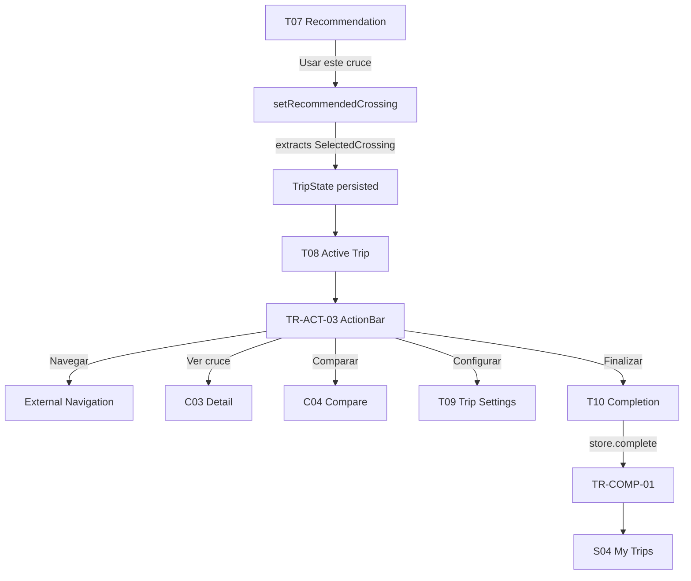

# W6 — Active Trip Workflow Specification
**Version:** 1.3 — 2026-09-11 — LIVE-01 locked; live crossing intelligence integrated; `useLiveCrossingSnapshot` added; TR-ACT-01 consumes LiveCrossingSnapshot. If version differs, revisit testing per `design/TESTING_INTEGRATION_PLAN.md:11` + `docs/TESTING_TOOLS.md`.

## Overview
| Field | Value |
|-------|-------|
| **Workflow ID** | W6 |
| **Name** | Active Trip / Checklist / Completion → My Trips |
| **Spec Sections** | §13 Lifecycle, §26-29, §48, §93, §98 |
| **Pages** | T07 → T08 → T09 → T10 → S04 |
| **Branching** | Checklist data-driven; only COMPLETED → My Trips |
| **Canonical types** | `TripRecommendation`, `SelectedCrossing` (`lib/recommendation/types.ts`) |

## Flow Diagram


## Page Sequence
| Step | Page ID | Page | Key Actions | Next |
|------|---------|------|-------------|------|
| 1 | T07 | Recommendation | Usar este cruce → setRecommendedCrossing | → T08 |
| 2 | T08 | Active Trip | TR-ACT-01..04 + StalePrompt + Aviso banner | → T09/T10 |
| 3 | T09 | Trip Settings | Editable TR-SETUP-* + Reset | → T08 |
| 4 | T10 | Completion | store.complete + TR-COMP-01 Guardar + Listo | → S04 |
| 5 | S04 | My Trips | SET-TRIP-01 Completed only | End |

## Component Catalog
| Component ID | Name | Responsibility |
|--------------|------|----------------|
| TR-ACT-01 | TripStatusHeader | Origin → Destination display |
| TR-ACT-02 | TripRouteSummary | Crossing name + wait time + total journey time |
| TR-ACT-03 | TripActionBar | Navegar + Ver cruce + Comparar + Configurar + Finalizar |
| TR-ACT-04 | TripChecklistSection | ANTES DE CRUZAR data-driven checklist |
| TR-ACT-05 | TripStalePrompt | 12h staleness recovery prompt |
| TR-COMP-01 | TripCompletionPrompt | VIAJE COMPLETADO + origin/destination/crossing + Guardar/Listo |

## Store Contract

### TripState (persisted via `cruze-trip`)
```typescript
interface TripState {
  // Context (from Trip Setup)
  start: StartPlace | null;
  destination: DestinationPlace | null;
  tripType: TripType;
  direction: TripDirection | null;
  travelMode: "walking" | "privateVehicle" | "commercial" | null;
  accessType: "standard" | "readyLane" | "sentri" | "unknown" | null;
  documentProfile: "passport" | "visa" | "usCitizen" | "trustedTraveler" | "unknown" | null;

  // Selection (from T07 commitment)
  recommendedCrossing: SelectedCrossing | null;

  // Ephemeral (NOT persisted)
  lastRecommendation: TripRecommendation | null;

  // Lifecycle
  completed: boolean;
  lastEvaluatedAt: string | null;
  completedTrips: CompletedTrip[];
}
```

### Lifecycle States (derived)
```
DRAFT / PLANNING  = Trip Setup wizard (local state, NOT in this store)
READY             = start + destination set, no recommendedCrossing
ACTIVE            = recommendedCrossing set, completed = false
COMPLETED         = completed = true
```

### State Transitions
```
T07 "Usar este cruce"
  → setRecommendedCrossing(rec: TripRecommendation)
  → extracts SelectedCrossing from rec.primary
  → stores both SelectedCrossing (persisted) and TripRecommendation (ephemeral)
  → lifecycle: READY → ACTIVE

"Finalizar" button
  → navigates to /trip/completion
  → completion page calls store.complete()
  → creates CompletedTrip record
  → lifecycle: ACTIVE → COMPLETED

"Start new" / stale prompt
  → store.reset()
  → lifecycle: any → DRAFT
```

## Hooks
| Hook | Purpose | Store fields consumed |
|------|---------|----------------------|
| `useTripStaleness` | 12h staleness detection + recovery | `destination`, `completed`, `lastEvaluatedAt` |
| `useNearbyCrossings` | Location-based nearby crossings (up to 10, display 3) | None (uses LocationData) |
| `useTripMapContext` | Derives map points from trip state | `start`, `destination`, `completed` |
| `useLiveCrossingSnapshot` | Live crossing intelligence — fetches, polls (5min), freshness, change detection | `recommendedCrossing.crossingId`, `direction` (from TripState) |

> **Live data architecture:** `LiveCrossingStore` (ephemeral) is separate from `TripState` (persisted). See `design/specs/LIVE-01.md` for full contract. TR-ACT-01, TR-ACT-02, and TR-ACT-04 consume `LiveCrossingSnapshot` as primary data source with `SelectedCrossing` as fallback.

## Dual-Purpose Page

T08 (`/trip`) handles both empty state and active state, split by `hasTrip = start !== null && destination !== null`:

- **Empty state:** LocationStatusBanner + TripHero + DestinationSearch + TripNearbyCrossingsSection
- **Active state:** TripStalePrompt (conditional) + TripStatusHeader + TripRouteSummary (conditional on recommendedCrossing) + TripActionBar + TripChecklistSection

## Files Reference
| File | Purpose |
|------|---------|
| src/app/[locale]/(main)/trip/page.tsx | T08 active + empty state |
| src/app/[locale]/(main)/trip/completion/page.tsx | T10 completion |
| src/app/[locale]/(main)/trip/configure/page.tsx | T09 re-entry |
| src/app/[locale]/settings/trips/page.tsx | S04 My Trips |
| src/stores/trip.ts | TripState store |
| src/stores/live-crossing.ts | LiveCrossingStore (ephemeral) — see LIVE-01 |
| src/hooks/useTripStaleness.ts | Staleness hook |
| src/hooks/useNearbyCrossings.ts | Nearby crossings hook |
| src/hooks/useTripMapContext.ts | Map context hook |
| src/hooks/useLiveCrossingSnapshot.ts | Live crossing intelligence hook — see LIVE-01 |
| src/lib/recommendation/types.ts | Canonical types |
| src/lib/live-crossing/types.ts | LiveCrossingSnapshot, CrossingFreshness — see LIVE-01 |
| src/lib/live-crossing/freshness.ts | calculateCrossingFreshness() — see LIVE-01 |
| src/lib/live-crossing/changes.ts | detectCrossingChanges() — see LIVE-01 |

## Audit Notes (v1.3)

### Resolved since v1.2
1. **Checklist now data-driven** — operational/freshness derive from LiveCrossingSnapshot status and generatedAt
2. **Dead code removed** — `TripEmptyActionPanel`, `viaje/TripSummary.tsx` deleted
3. **i18n complete** — TR-ACT-02, TR-ACT-03, TR-COMP-01, completion page all use `useTranslations()`

### Known gaps (documented, not yet fixed)
1. **`lastRecommendation` not used** — active trip page shows alternatives/reasoning via legacy viaje component (dead code) rather than new components

### Resolved since v1.3
3. **Avisos wired (AV-01)** — `useAvisos` bridges `useLiveCrossingSnapshot` changes into `AvisosStore`; T08 renders `AvisoBanner`; alerts page reads the Avisos store
4. **Checklist live-driven (P2)** — `buildTripChecklistItems()` prefers `LiveCrossingSnapshot` with `SelectedCrossing` fallback (`src/lib/trip-checklist.ts`)
5. **Proactive notifications (P4)** — `useCriticalAvisoNotifications` fires one system Notification per critical aviso; opt-in on alerts page
6. **Offline outbox (P5)** — agent store persists queued messages; `AgentChat` flushes FIFO on reconnect (`src/lib/agent-outbox.ts`)
