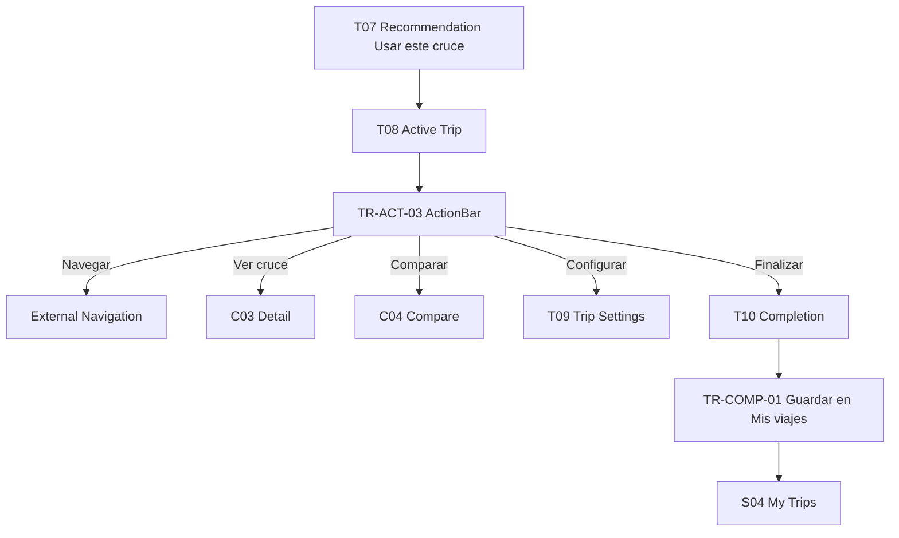

# W6 — Active Trip Workflow Specification

## Overview
| Field | Value |
|-------|-------|
| **Workflow ID** | W6 |
| **Name** | Active Trip / Checklist / Completion → My Trips |
| **Spec Sections** | §13 Lifecycle, §26-29, §48, §93, §98 |
| **Pages** | T07 → T08 → T09 → T10 → S04 |
| **Branching** | Checklist data-driven; only COMPLETED → My Trips |

## Flow Diagram


## Page Sequence
| Step | Page ID | Page | Key Actions | Next |
|------|---------|------|-------------|------|
| 1 | T07 | Recommendation | Usar este cruce | → T08 |
| 2 | T08 | Active Trip | TR-ACT-01..04 + Aviso banner | → T09/T10 |
| 3 | T09 | Trip Settings | Editable TR-SETUP-* + Reset | → T08 |
| 4 | T10 | Completion | TR-COMP-01 Guardar + Listo | → S04 |
| 5 | S04 | My Trips | SET-TRIP-01 Completed only | End |

## Component Catalog
| Component ID | Name | Responsibility |
|--------------|------|----------------|
| TR-ACT-01 | TripStatusHeader | ACTIVE + route Mexico→US + ●Abierto |
| TR-ACT-02 | TripRouteSummary | Visual route Origin → San Ysidro → Destination |
| TR-ACT-03 | TripActionBar | [Navegar] Mint + Ver cruce + Comparar + Configurar + Agente + Finalizar |
| TR-ACT-04 | TripChecklistSection | ANTES DE CRUZAR data-driven checklist |
| TR-COMP-01 | TripCompletionPrompt | VIAJE COMPLETADO + Guardar en Mis viajes |

## Lifecycle
```
DRAFT → PLANNING → READY → ACTIVE → AT_BORDER → COMPLETED
Only COMPLETED eligible for My Trips (isEligibleForMyTrips)
```

## Files Reference
| File | Purpose |
|------|---------|
| src/app/[locale]/(main)/trip/page.tsx | T08 active state shares with T01 |
| src/app/[locale]/(main)/trip/configure/page.tsx | T09 re-entry CONF |
| src/app/[locale]/trip/completion/page.tsx | T10 |
| src/app/[locale]/settings/trips/page.tsx | S04 |
