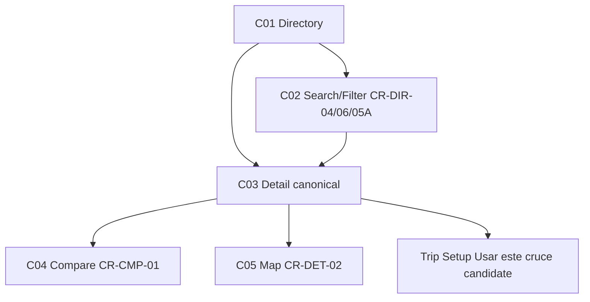

# W7 — Crossings Workflow Specification
**Version:** 1.7 — 2026-09-08 — T07 locked; C03/C04 handoff produces `crossingCandidate` (TripSetupState), not `recommendedCrossing` (TripState). If version differs, revisit testing per `design/TESTING_INTEGRATION_PLAN.md:11` + `docs/TESTING_TOOLS.md`.

## Overview
| Field | Value |
|-------|-------|
| **Workflow ID** | W7 |
| **Name** | Crossings Directory / Detail / Compare → Trip |
| **Spec Sections** | §30-40 |
| **Pages** | C01 → C02 → C03 → C04 → C05 → Trip (Usar) |
| **Branching** | Canonical detail 5 entry routes converge to C03; NEAREST sort default (operator decision; W7 §13 canon is RELEVANCE) |

## Flow Diagram


## Page Sequence
| Step | Page ID | Page | Key Actions | Next |
|------|---------|------|-------------|------|
| 1 | C01 | Directory | Toolbar + Sheet + Summary/Sort + List + LoadMore | → C03 |
| 2 | C02 | Search/Filter | Todos/México/EE.UU. + Vehículo/A pie/Comercial sort NEAREST-first | → C03 |
| 3 | C03 | Detail | Header (← CRUCES + Share + Favorite) + Hero (identity only) + Map + Lane (live-only, category-qualified) + Hours (sourced-only) + agent text-link + in-flow ActionBar (primary + "Comparar cruces →") | → C04/Trip/Agent |
| 4 | C04 | Compare | Matrix CR-CMP-01 attribute rows + winner/fastest/alternative + bothDirections + context label + per-row handoff → Trip |
| 5 | C05 | Map | Contextual map CR-DET-02 with route overlay (journey context) + crossing-only fallback → Trip |

## Component Catalog
| Component ID | Name | Responsibility |
|--------------|------|----------------|
| CR-DIR-01 | CrossingsDirectoryList | Presentational list (server-driven, empty ≠ unavailable) |
| CR-DIR-02 | CrossingsDirectoryRow | Compact row Name + Status + North/South Wait |
| CR-DIR-03 | CrossingsDirectoryExpandedRow | Expanded lane/access/hours (conditional) |
| CR-DIR-04 | CrossingsDirectorySearchInput | [Buscar cruces...] |
| CR-DIR-05 | CrossingsDirectoryFilterBar | RETIRED — superseded by CR-DIR-06 + CR-DIR-05A |
| CR-DIR-05A | CrossingsDirectoryFilterSheet | Scope/mode/state + fixed Aplicar footer |
| CR-DIR-06 | CrossingsDirectoryToolbar | Search + ≡ trigger (headerCompanion) |
| CR-DIR-07 | CrossingsDirectorySummary | Total + scope copy |
| CR-DIR-08 | CrossingsDirectorySortControl | Compact sort, NEAREST default |
| CR-DIR-09 | CrossingsDirectoryLoadMoreState | Cargar más / spinner |
| CR-DET-01..10 | CrossingDetail* | Hero (both-mode) Map Lane Hours Favorite ActionBar (+Comparar); 04/06/07/08 sourced-only |
| CR-CMP-01 | CrossingsCompareTable | §31 comparison matrix: attribute rows + winner/fastest/alternative + bothDirections + compat + per-row handoff |
| CR-STATUS-01..05 | Crossing status primitives | Operational vs Freshness separation mandatory |

## C03 action model (locked)

```text
HEADER: ← Back to Cruces · ↗ Share · ☆ Favorite
HERO: identity + state + waits + freshness (no actions)
MAP · LANE (category-qualified) · HOURS (sourced-only)
CONTEXTUAL: "Preguntar al agente →" quiet text-link (min 44px touch)
ACTION BAR (in-flow): Usar este cruce (primary) · Comparar cruces → (text)
```

Agent is a primary destination; C03 provides one contextual handoff
(non-persisted `pendingContext`), not a feature block. Reportar/Avisarme
deferred — no UI.

## Page Composition Standard

Learned from C01/T01, canonical for C03/C04 and every subsequent page.

### A. Page shell

```text
Page
├── Header
├── Content
│   ├── Intro / identity
│   ├── Primary information
│   ├── Supporting information
│   └── Actions
└── Bottom navigation
```

### B. Horizontal rhythm

All page content uses the canonical content inset (`px-4 sm:px-5`).
No component extends to the viewport edge unless explicitly designated
full-bleed. No `-mx-*` edge compensation, no `pb-*` fixed-bar compensation.
Page-level action groups render INSIDE the padded container as the last
content block — never as a sibling after it closes (that drops CTAs to
viewport edges, outside content margins).

### C. Vertical rhythm (semantic tiers, 4px scale)

```text
4    micro (icon ↔ label tight)
8    tight
12   related (primary → secondary actions)
16   component
24   section
32   major section
40   major transition
```

Page top/bottom breathing room: 24–32px. Never a uniform `space-y-6`
across unrelated blocks — rhythm follows the tiers above.

### D. Typography hierarchy

```text
Sora:  Display / page identity · high-value numeric data
Inter: Body · Labels · Navigation · Metadata · Controls · Actions
```

Sora signals display/data hierarchy, never generic UI text.

### E. Action hierarchy

Every screen declares Primary / Secondary / Contextual / Utility.
Only the primary gets button treatment. Secondary = text action
(e.g. "Comparar cruces →"). Contextual = quiet text-link.
Utility = header icons.

### F. Fixed positioning

Default: no fixed content-level CTA bars. Fixed UI is reserved for
global navigation and system-level persistent controls. C03's former
sticky dock is the anti-pattern: removing it (not padding around it)
is the fix.

C04 inherits this standard from day one (verified: no fixed dock,
no edge bleed, no pb compensation in compare route).

## Files Reference
| File | Purpose |
|------|---------|
| src/app/[locale]/(main)/crossings/page.tsx | C01 |
| src/app/[locale]/crossing/[id]/page.tsx | C03 |
| src/app/[locale]/(main)/crossings/compare/page.tsx | C04 |
| src/components/crossing/CrossingsCompareTable.tsx | C04 |
| src/components/crossing/CrossingDetailMap.tsx | C05 |
| src/lib/crossings-query.ts | §34 query contract (scope/mode/status/search/sort/direction/cursor/limit) |