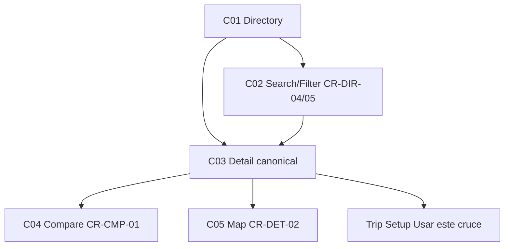

# W7 — Crossings Workflow Specification

## Overview
| Field | Value |
|-------|-------|
| **Workflow ID** | W7 |
| **Name** | Crossings Directory / Detail / Compare → Trip |
| **Spec Sections** | §30-40 |
| **Pages** | C01 → C02 → C03 → C04 → C05 → Trip (Usar) |
| **Branching** | Canonical detail 5 entry routes converge to C03; relevance default |

## Flow Diagram

## Page Sequence
| Step | Page ID | Page | Key Actions | Next |
|------|---------|------|-------------|------|
| 1 | C01 | Directory | List + FilterBar + Row + ExpandedRow + Search | → C03 |
| 2 | C02 | Search/Filter | Todos/Mexico/EEUU + Auto/A pie/Comercial sort relevance/speed | → C03 |
| 3 | C03 | Detail | Hero + Map + Lane + Access + Hours + Requirements + Restrictions + Services + Favorite + ActionBar | → C04/Trip |
| 4 | C04 | Compare | Table CR-CMP-01 Wait Travel Total Distance Status Access Freshness | → Trip |
| 5 | C05 | Map | Contextual map route overlay | → Trip |

## Component Catalog
| Component ID | Name | Responsibility |
|--------------|------|----------------|
| CR-DIR-01 | CrossingsDirectoryList | Container list |
| CR-DIR-02 | CrossingsDirectoryRow | Compact row Name + Status + North/South Wait |
| CR-DIR-03 | CrossingsDirectoryExpandedRow | Expanded lane/access/hours |
| CR-DIR-04 | CrossingsDirectorySearchInput | [Buscar cruces...] |
| CR-DIR-05 | CrossingsDirectoryFilterBar | Todos/Mexico/EEUU + mode + sort |
| CR-DET-01..10 | CrossingDetail* | Hero Map Lane Access Hours Requirements Restrictions Services Favorite ActionBar |
| CR-CMP-01 | CrossingsCompareTable | Decision table winning apparent |
| CR-STATUS-01..05 | Crossing status primitives | Operational vs Freshness separation mandatory |

## Files Reference
| File | Purpose |
|------|---------|
| src/app/[locale]/(main)/crossings/page.tsx | C01 |
| src/app/[locale]/crossing/[id]/page.tsx | C03 |
| src/components/crossing/CrossingsCompareTable.tsx | C04 |
| src/components/crossing/CrossingDetailMap.tsx | C05 |
