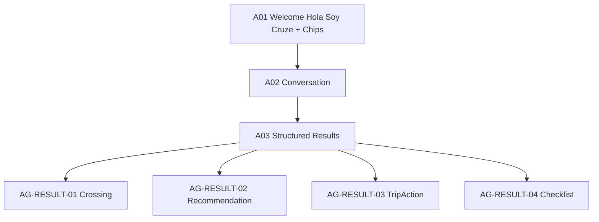

# W8 — Agent Workflow Specification

## Overview
| Field | Value |
|-------|-------|
| **Workflow ID** | W8 |
| **Name** | Agent Welcome → Conversation → Contextual Results |
| **Spec Sections** | §41-44, §86-88 |
| **Pages** | A01 → A02 → A03 |
| **Branching** | Context-aware: location/trip/crossing/avisos → contextual else general |

## Flow Diagram

## Page Sequence
| Step | Page ID | Page | Key Actions | Next |
|------|---------|------|-------------|------|
| 1 | A01 | Welcome | AG-WEL-01 + AG-PROMPT-01/02 + AG-COMP-01 | → A02 |
| 2 | A02 | Conversation | AG-MSG-01/02 + composer | → A03 |
| 3 | A03 | Results | AG-RESULT-01..04 deep-links to Detail/Recommendation/Trip/Checklist | End |

## Component Catalog
| Component ID | Name | Responsibility |
|--------------|------|----------------|
| AG-HEAD-01 | AgentHeader | AGENTE header |
| AG-WEL-01 | AgentWelcome | Hola Soy Cruze intro |
| AG-PROMPT-01 | AgentPromptList | Container of chips |
| AG-PROMPT-02 | AgentPromptChip | Suggested prompt |
| AG-MSG-01 | AgentMessageList | Scroll container |
| AG-MSG-02 | AgentMessage | Bubble User/Assistant/System |
| AG-COMP-01 | AgentComposer | Input Escribe... |
| AG-RESULT-01..04 | Agent results | Crossing/Recommendation/TripAction/Checklist |

## Files Reference
| File | Purpose |
|------|---------|
| src/app/[locale]/(main)/agent/page.tsx | A01/A02 |
| src/components/agent/AgentChat.tsx | Composer + list |
