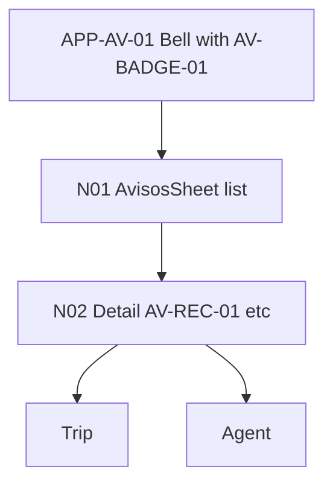

# W9 — Avisos Workflow Specification
**Version:** 1.1 — 2026-09-04 — W5 canon 1.1 (radii 4/8/12/16/20, nav 56/80+safe). If version differs, revisit testing per `design/TESTING_INTEGRATION_PLAN.md:11` + `docs/TESTING_TOOLS.md`.

## Overview
| Field | Value |
|-------|-------|
| **Workflow ID** | W9 |
| **Name** | Avisos List → Detail → Trip/Agent |
| **Spec Sections** | §9, §45-46, §95 |
| **Pages** | N01 → N02 → Trip/Agent |
| **Branching** | Bell globally accessible, groups today/yesterday/earlier, WHAT/WHY/ACTION |

## Flow Diagram

## Page Sequence
| Step | Page ID | Page | Key Actions | Next |
|------|---------|------|-------------|------|
| 1 | N01 | Avisos List | AV-HEAD-01 + AV-ROW-01 + AV-EMPTY-01 groups today/yesterday/earlier | → N02 |
| 2 | N02 | Detail | AV-CROSS-01/AV-REC-01/AV-TRIP-01/AV-CHECK-01/AV-DATA-01 | → Trip/Agent |
| 3 | — | Trip/Agent | Deep links: Ver recomendación / Por qué? / Revisar checklist | End |

## Component Catalog
| Component ID | Name | Responsibility |
|--------------|------|----------------|
| AV-HEAD-01 | AvisosSheet | Global sheet/page |
| AV-BADGE-01 | AvisosBadge | Unread Mint dot |
| AV-ROW-01 | AvisoRow | Generic title snippet recency |
| AV-CROSS-01 | AvisoCrossingChange | Crossing closed/wait change |
| AV-REC-01 | AvisoRecommendationChange | TU RECOMENDACIÓN CAMBIÓ |
| AV-TRIP-01 | AvisoTripReminder | Reminder |
| AV-CHECK-01 | AvisoChecklistReminder | Antes de cruzar reminder |
| AV-DATA-01 | AvisoDataWarning | Stale/unavailable |
| AV-EMPTY-01 | AvisosEmptyState | Todo tranquilo... |

## Files Reference
| File | Purpose |
|------|---------|
| src/app/[locale]/alerts/page.tsx | N01 |
| src/components/avisos/AvisosList.tsx | N01 |